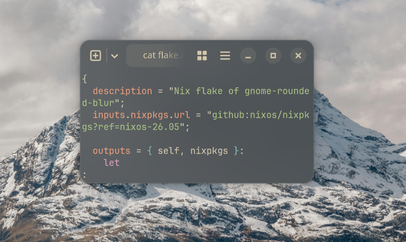

# Nixos flake for `gnome-rounded-blur`

This is a nix flake for [GNOME Rounded Blur](https://github.com/kancko/gnome-rounded-blur).

## Installation

> Note, currently supported systems are `Nixos` and `x86_64-linux`, open an issue if there is interest for home-manager support.

1. Add it to flake inputs: 
  ```nix
  inputs = {
    gnome-rounded-blur.url = "github:Klazkin/nix-gnome-rounded-blur";
    # ...
  }
  ```
2. Import the nixos module somewhere, for example in `configuration.nix`
  ```nix
  { inputs, ... }: {
    imports = [ inputs.gnome-rounded-blur.nixosModules.default ];
  }
  ```

3. That's it. If you are using this with `blur-my-shell` extensions, you may need to log out of Gnome for the new blur effect to be detected.
  
  
